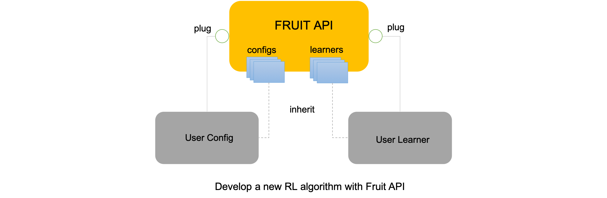
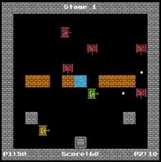
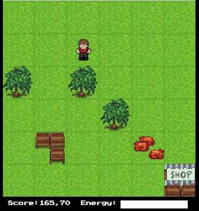
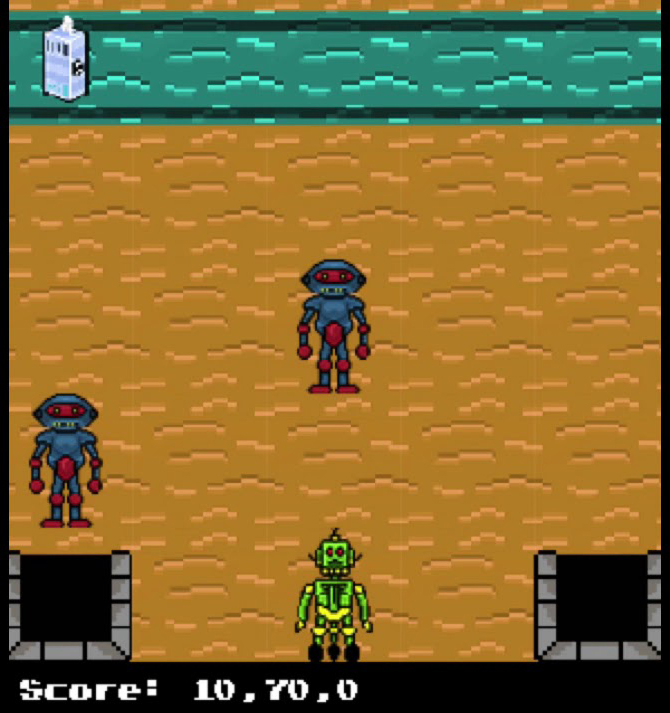

# Introduction

**Fruit API** (http://fruitlab.org/) is a universal deep reinforcement learning framework, which is designed 
meticulously to provide a *friendly* user interface. Specifically, **Fruit API** has the 
following noticeable contributions:


* **Friendly API**: **Fruit API** follows a modular design combined with the OOP in Python
to provide a solid foundation and an easy-to-use user interface via a simplified 
API. Based on the design, our ultimate goal is to provide researchers a means to 
develop reinforcement learning (RL) algorithms with little effort. In particular, 
it is possible to develop a new RL algorithm under 100 lines of code. What users 
need to do is to create a `Config`, a `Learner`, and plug them into the framework. We
also provides a lot of sample `Config`s and `Learner`s in a hierarchical structure
so that users can inherit a suitable one.



* **Portability**: The framework can work properly in different operating systems such as 
Windows, Linux, and Mac OS.

* **Interoperability**: We keep in mind that **Fruit API** should work with any deep learning
libraries such as PyTorch, Tensorflow, Keras, etc. Researchers would define the neural 
network architecture in the config file by using their favourite libraries. Instead of 
implementing a lot of deep RL algorithms, we provide a flexible way to integrate 
existing deep RL libraries.

* **Generality**: The framework supports different disciplines in reinforement learning 
such as multiple objectives, multiple agents, and human-agent interaction.

We also implemented a set of deep RL baselines in different RL disciplines as follows.

*Value-based deep RL*:

 * Deep Q-Network (DQN)
 * Double DQN
 * Dueling network with DQN
 * Prioritized Experience Replay (proportional approach)
 * DQN variants (asynchronous/synchronous method)
 
*Policy-based deep RL*:

 * A3C
 
*Multi-agent deep RL*:

 * Multi-agent A3C
 * Multi-agent A3C with communication map
 
*Multi-objective RL/deep RL*:

 * Q-Learning
 * Multi-objective Q-Learning (linear and non-linear method)
 * Multi-objective DQN (linear and non-linear method)
 * Multi-objective A3C (linear and non-linear method)
 * Single-policy/multi-policy method
 * Hypervolume
 
*Human-agent interaction*

 * A3C with map
 * Divide and conquer strategy with DQN
 
*Built-in environments*

 * Arcade learning environment (Atari games)
 * OpenAI Gym
 
External environments can be integrated into the framework easily by plugging into 
`FruitEnvironment`. Finally, we developed 5 extra environments as a testbed to examine different 
disciplines in deep RL:

* Mountain car (multi-objective environment/graphical support)
* Deep sea treasure (multi-objective environment/graphical support)
* Tank battle (multi-agent/multi-objective/human-agent cooperation environment)
* Food collector (multi-objective environment)
* Milk factory (multi-agent/heterogeneous environment)
 
Video demonstrations can be found here (click on the images):

<div align="center">
  <a href="https://www.youtube.com/watch?v=WCa6n1F6UM8" target="_blank">
    
  </a>
  <a href="https://www.youtube.com/watch?v=eoud2D0nW1k" target="_blank">
    
  </a>
  <a href="https://www.youtube.com/watch?v=usJP9Gr9nkM" target="_blank">
    
  </a>
  <br /><br />
</div>
 
# Documentation

1. [Installation guide](http://fruitlab.org/installation_2.html)

2. [Quick start](http://fruitlab.org/examples.html)

3. [API reference](http://fruitlab.org/api.html)

Please visit our official website [here](http://fruitlab.org/) for more updates, tutorials, sample codes, etc.

# References

[ReinforcePy](https://github.com/Islandman93/reinforcepy) is a great repository that we referenced during
the development of **Fruit API**.

# Credit

Please cite our work in your papers or projects as follows. All contributions to the work are welcome.

```bibtex
@misc{nguyen2019fruitapi,
    author = {{Nguyen}, N.~D. and {Nguyen}, T.~T.},
    title = {Fruit API - A Universal Deep Reinforcement Learning Framework},
    year = {2019},
    publisher = {GitHub},
    journal = {GitHub repository},
    howpublished = {\url{https://github.com/garlicdevs/Fruit-API}},
}
```


